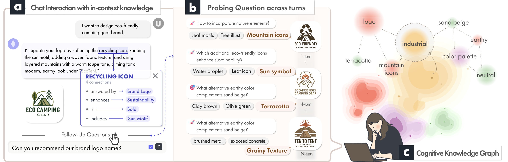

# CogChat

**Knowledge Graph-Augmented Conversational AI with a Heterogeneous Graph Transformer for Cognitive Grounding in Design Generation**

UIST '26 &middot; Jiin Choi, Kyung Hoon Hyun &middot; Design Informatics Lab, Hanyang University

CogChat grounds an LLM chat assistant in a personal **heterogeneous knowledge graph** built from each designer's input, and uses a **Heterogeneous Graph Transformer (HGT)** to select the structurally relevant nodes for every response — and to generate *intentional* and *exploratory* probing questions.

LLM chat systems keep context through *recency*: the last few turns in a sliding window. In design conversation this breaks down — relational meaning decays between turns, identical words mean different things to different designers, and the conversation loops instead of deepening. CogChat preserves the relational structure of how a designer thinks, rather than what they said most recently.

## Contents

- **Problem** — why recency-based context loses the relations design reasoning runs on
- **Interface** — interactive in-context entity inspection
- **Pipeline** — the five per-turn stages (KG construction → link sets → HGT embedding → grounded response → probing)
- **Probing questions** — intentional vs. exploratory, derived from graph structure
- **Results** — technical evaluation (ASQA, RewardBench) and the within-subjects study with nine professional designers
